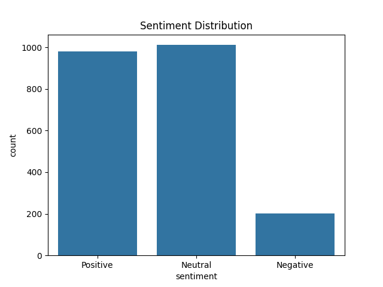
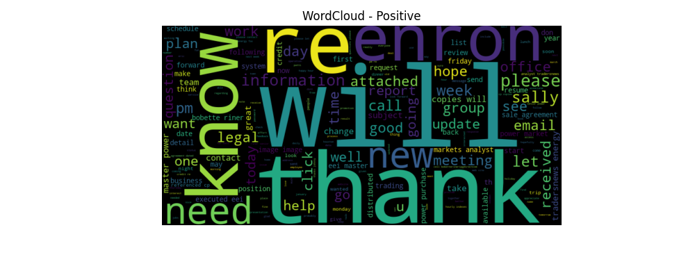
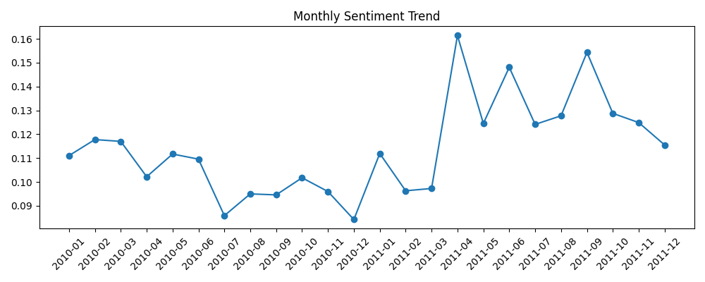
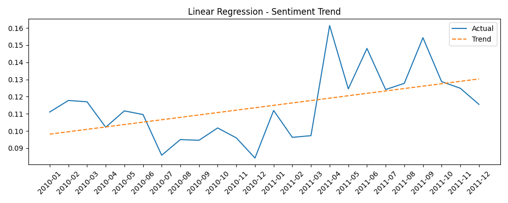

# 📊 Employee Sentiment Analysis Project

This project performs **Sentiment Analysis** on employee feedback using NLP techniques. The goal is to label sentiments, explore trends, identify flight risks, and present insights visually.

## ✅ Project Summary

- **Sentiment Labeling**: Positive, Neutral, Negative (via TextBlob)
- **EDA & Visualization**: Explore and understand feedback distribution
- **Monthly Sentiment Scoring**: Track sentiment over time
- **Employee Ranking**: Based on average sentiment polarity
- **Flight Risk Detection**: Identify consistently negative feedback
- **Trend Analysis**: Linear regression on sentiment scores

---

## 🗂️ Files in this Repository

| File Name                     | Description                                       |
|------------------------------|---------------------------------------------------|
| `llm_sentiment_project.ipynb` | Jupyter Notebook with full analysis              |
| `test(in).csv`               | Input dataset of employee feedback               |
| `processed_sentiment_data.csv` | CSV with sentiment labels                        |
| `flight_risk_employees.csv`  | Flagged employees at risk                        |
| `README.md`                  | Project documentation                            |
| `wordcloud_positive.png`     | Wordcloud of positive sentiment words            |
| `monthly_sentiment_trend.png` | Monthly sentiment trend                          |
| `regression_trend.png`       | Linear regression of sentiment trend             |
| `sentiment_distribution.png` | Bar chart of sentiment distribution              |

---

## 🖼️ Visualizations

### 📌 Sentiment Distribution


### 🌤️ Wordcloud of Positive Feedback


### 📅 Monthly Sentiment Trend


### 📉 Sentiment Trend Regression Line


---

📌 Methodology Overview

🔍 Step-by-Step Process:
Text Cleaning & Preprocessing

Sentiment Scoring using TextBlob

Visualization:

Bar chart of sentiments

Wordcloud (positive feedback)

Monthly sentiment analysis

Regression line to show sentiment shift

Employee Ranking by polarity

Flight Risk Analysis using thresholds on negative sentiment

🔐 Environment
No external APIs used

No .env file required

## 🛠️ Setup Instructions

1. **Clone this repo** or download the ZIP
2. Install required packages:
```bash
pip install pandas numpy matplotlib seaborn wordcloud textblob scikit-learn
